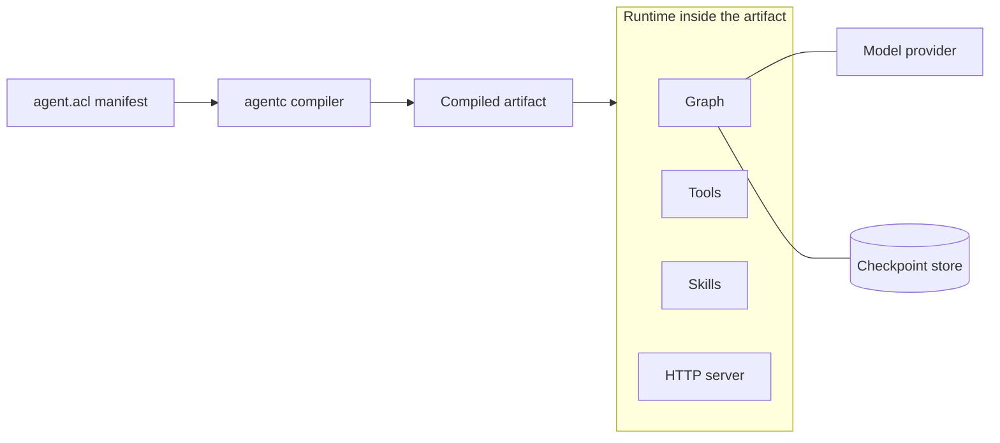

agentc turns a declarative description of an agent into a self-contained program you can deploy. This
page is the map: what the moving parts are, how a description becomes a running agent, and where each
concept lives. Read it first, then follow the links at the end into the more detailed concept pages.

## From description to running agent

There are three things to hold in your head, in the order they come into play.

**The manifest** is a file named `agent.acl` that describes your agent: which archetype to target,
which model providers are available, the agent's prompt and model, the tools it can call, the skills
it knows, and how it is served. It is the single source of truth, and it is the only thing you write
by hand.

**The compiler** is the `agentc` command-line tool. It reads the manifest, gathers and builds your
tools, generates a complete project, and compiles that project into an artifact. Nothing about your
agent runs during compilation; the compiler only produces the artifact.

**The artifact** is the output. For the `standalone` archetype it is a single binary that embeds your
tools, your skills, and the entire runtime. You deploy the artifact by copying it and setting
environment variables. There is no separate framework or service to install alongside it.

## What the runtime contains

When the artifact runs, it hosts everything the agent needs under one process:

- A **model provider** connection, which is how the agent talks to an LLM such as Anthropic or OpenAI.
- The **graph**, which is the reasoning loop that decides when to call the model and when to call
  tools. Every graph is checkpointed, so a run survives crashes and resumes where it left off.
- The **tools** the agent can invoke, each dispatched to the right execution environment (a JavaScript
  runtime, a Python interpreter, a sandboxed shell, or an external Model Context Protocol server).
- The **skills** the agent can draw on, which are Markdown documents that guide how it behaves.
- An optional **HTTP server** that exposes the agent over a native API and, if enabled, standardized
  protocol add-ons such as AG-UI.

## Build-time versus runtime

A recurring idea across agentc is the split between what is decided when you compile and what is
decided when you deploy. Structural choices, such as the archetype and the graph, are fixed into the
artifact at build time. Operational values, such as hosts, ports, and API keys, are read from the
environment when the binary starts. This is what lets you build one artifact and run it unchanged
across development, staging, and production. The manifest expresses this distinction directly through
`runtime()` and `secret()` expressions.

## Where to go next

- [The manifest](/concepts/the-manifest): the file you write, and how build-time and runtime values work.
- [The compilation pipeline](/concepts/the-compilation-pipeline): what `agentc build` does, stage by stage.
- [Archetypes](/concepts/archetypes): how an archetype decides the shape of the artifact.
- [The graph](/concepts/the-graph): the reasoning loop and the durability guarantee.
- [Serving and protocols](/concepts/serving-and-protocols): how an agent is exposed over HTTP.
