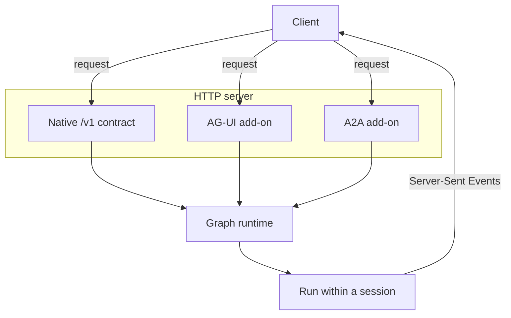

An agent can run as a plain process, but most production deployments expose it over HTTP. The
`http_server` block in the manifest turns on a built-in server. This page explains what that server
offers and how the native contract relates to the standardized protocol add-ons layered on top of it.

## The native contract

Every agent exposes a native HTTP contract derived from its graph. This contract is the low-level API
the agent speaks directly: it manages runs, keeps sessions continuous, persists messages, and
synchronizes state. Because it comes from the graph, its exact request and response shapes depend on
which graph the agent uses. For the ReAct graph, a request maps onto a durable session, each execution
is a run, and the run emits events that clients can stream.

## Protocol add-ons

The native contract is complete, but clients in the wider ecosystem often speak an established
protocol rather than a bespoke one. The `protocol` block mounts add-ons alongside the native contract
that implement widely adopted specs, so existing tooling can connect without custom integration code.

The AG-UI add-on mounts the AG-UI streaming protocol, which makes the agent directly compatible with
CopilotKit and other frameworks built on that spec. Both the native contract and the AG-UI add-on are
driven by the same underlying graph behavior; the add-on is a translation layer, not a second agent.
Connecting a CopilotKit frontend is covered in
[Connect a CopilotKit frontend](/guides/connect-a-copilotkit-frontend).

The A2A add-on mounts a foundational Agent2Agent protocol surface for agent-to-agent delegation. An
upstream agent can discover the generated agent through an Agent Card, send a message as a task,
stream task updates, read a known task, and cancel a task. In the current implementation, an A2A task
maps to an agent run, an A2A context maps to a session, and task artifacts carry the agent's text or
structured output.

This is inbound A2A serving. Outbound A2A delegation is configured as a tool with
`tool { kind = "a2a" }`, which lets this agent call a specific downstream A2A server. See
[Connect agents via A2A](/guides/connect-agents-via-a2a).

## Multi-tenancy

The server is multi-tenant aware. A request can carry an `X-Tenant-Id` header to attribute the run to
a specific tenant, and requests without the header fall back to a configured default tenant. This lets
one deployment serve many isolated callers.

## Operating the server

The server generates an OpenAPI specification for all mounted routes and serves interactive
documentation, so the live contract is always discoverable from the running agent. When running behind
a reverse proxy, forward the usual client headers and, importantly, disable response buffering on
streaming endpoints, because Server-Sent Events require data to reach the client as it is produced. TLS
is typically terminated at the proxy, with the agent reached over plain HTTP on an internal network.
The exact fields that enable and tune the server are on the
[http_server reference page](/reference/manifest/http-server).

## Where to go next

- [The graph](/concepts/the-graph): the loop the native contract exposes.
- [HTTP reference](/reference/graph/react/http): the native endpoints and their shared conventions.
- [AG-UI](/reference/http-api/ag-ui): the AG-UI protocol add-on.
- [A2A](/reference/http-api/a2a): the Agent2Agent protocol add-on.
- [Connect agents via A2A](/guides/connect-agents-via-a2a): configure outbound A2A delegation.
- [http_server reference](/reference/manifest/http-server): the fields that configure the server.
