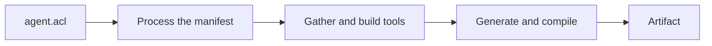

When you run `agentc build`, the compiler processes your `agent.acl` manifest through three
high-level stages and produces a deployable artifact. Understanding these stages helps you reason
about build times, cache behavior, and where a build can fail.

<Steps>
  <Step step={1} title="Process the manifest">
    The compiler reads and validates your `agent.acl` manifest. All `locals` references are
    expanded, and the full configuration for code generation is assembled. This includes resolving
    which archetype to target and collecting all asset references.
  </Step>
  <Step step={2} title="Gather and build tools">
    Each tool source is fetched and prepared for embedding. JavaScript and TypeScript tools are
    bundled into a single file using esbuild. Python tool dependencies are installed using `uv`
    based on the tool's `pyproject.toml`. MCP tools are not embedded; their configuration is
    captured for runtime. After this stage, every embeddable tool is ready.
  </Step>
  <Step step={3} title="Generate and compile">
    The archetype generates a complete project from templates and compiles it into the final
    artifact using the archetype's build toolchain. For `standalone`, this runs `cargo build
    --release` and produces a binary at `artifacts/build/<agent-name>`.
  </Step>
</Steps>

## The generated project

Between the second and third stages, a complete project is written to `artifacts/generated`. For
the `standalone` archetype, this is a standard Rust workspace. You can open it, read the generated
source, modify it by hand, or build it directly with `cargo build --release` without the agentc
CLI.

## Stopping before compilation

Two commands let you observe the pipeline without running it to completion.

`agentc generate` runs the first two stages and the generation step, then stops before compiling.
The generated project is written to `artifacts/generated`. This is useful for inspecting what was
generated, making manual modifications before building, or debugging a compilation failure.

`agentc inspect` parses and resolves the manifest without running any build stages. It prints the
fully resolved configuration with all `locals` expanded and `runtime()` values replaced by their
defaults. Secrets are redacted.

## Where to go next

- [Archetypes](/concepts/archetypes): what the generate-and-compile stage produces, and the toolchain it needs.
- [Extend code generation with blocks](/guides/extend-codegen-with-blocks): inject your own files into the generated project.
- [agentc build](/reference/cli/build): every flag on the build command.
- [agentc generate](/reference/cli/generate) and [agentc inspect](/reference/cli/inspect): the commands that stop early.
