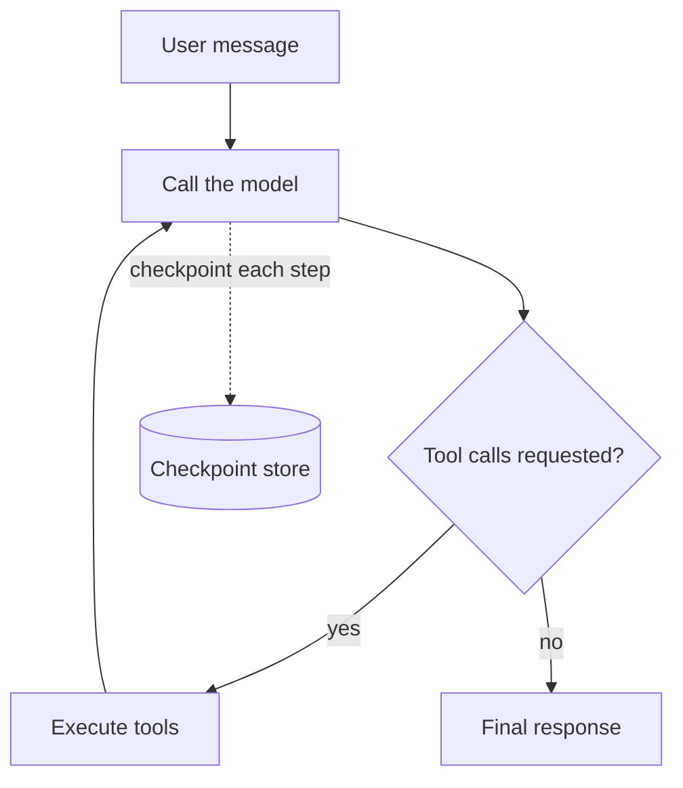

The graph is the engine that runs your agent. It defines the loop the agent goes through to handle
a request: receiving input, deciding what to do, calling tools, observing results, and continuing
until the task is complete. The graph is what turns a model and a set of tools into an agent that
can reason and act.

You select the graph inside each `agent` block:

```hcl
agent "assistant" {
  graph {
    type = "react"
  }
}
```

`react` is the only graph shipped in this distribution today.

Every graph implementation in agentc is durable. State is checkpointed to persistent storage at
each step of execution. If the process crashes, is restarted, or encounters an infrastructure
failure, the agent resumes exactly where it left off on the next run.

## The ReAct graph

The current graph implementation is ReAct (Reasoning and Acting). From a user's perspective, the
loop works like this:



1. The agent receives a message from the user.
2. The model is called with the current conversation and the list of available tools.
3. If the model requests tool calls, those tools execute and their results are added to the conversation.
4. The model is called again with the updated context.
5. This continues until the model signals it is done, at which point the run completes.

The agent does not manage this loop manually. You configure the model, the tools, the system prompt,
and the graph selection, and the graph handles the rest.

## Durability in practice

Because every step is checkpointed, you get several useful properties:

- **Crash recovery:** if the process dies mid-run, the next request for the same session picks up from the last saved checkpoint automatically.
- **Long-running tasks:** the agent can work through tasks that span many tool calls and model invocations without risk of losing progress.
- **Auditability:** the full history of every run is persisted, including all messages, tool calls, and tool results.

The checkpoint store requires a database. SQLite works well for development and single-machine
deployments. PostgreSQL is recommended for production. See
[Deploy a standalone binary](/guides/deploy-standalone) for configuration details.

## Graph state

Each graph implementation has its own state structure. The state persists across the run and holds
everything the agent needs between steps. Tools can receive a snapshot of the current state and
return updates to it alongside their output. What fields are readable and writable depends on the
graph implementation.

For the full state structure, update rules, and the client-visible state contract for the current
graph, see the [ReAct graph reference](/reference/graph/react).

## Where to go next

- [Tools and capabilities](/concepts/tools-and-capabilities): what the loop calls, and how access is controlled.
- [Serving and protocols](/concepts/serving-and-protocols): how a run is driven and streamed over HTTP.
- [ReAct state reference](/reference/graph/react/state): the exact state structure and update contract.
